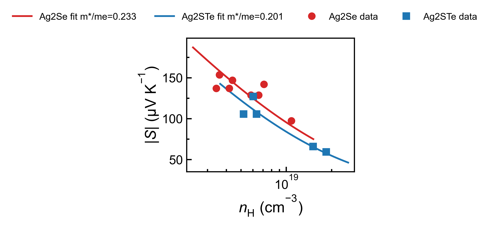
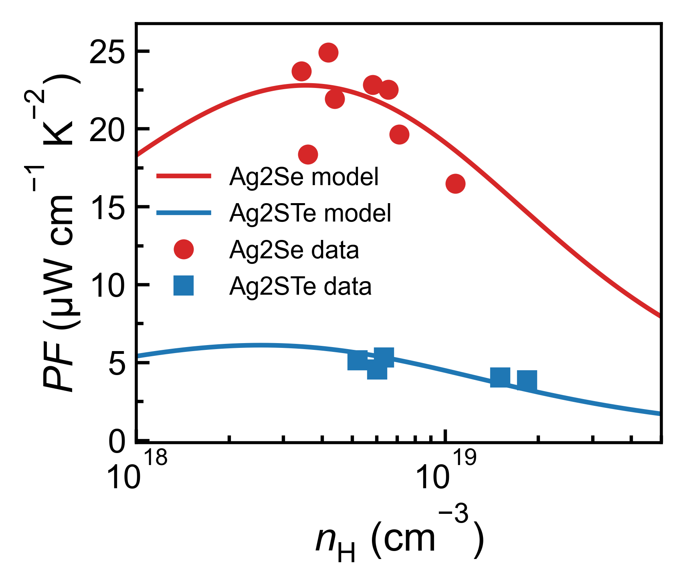
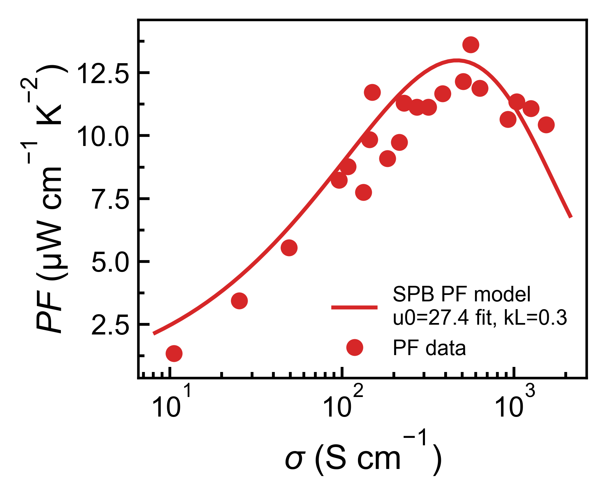
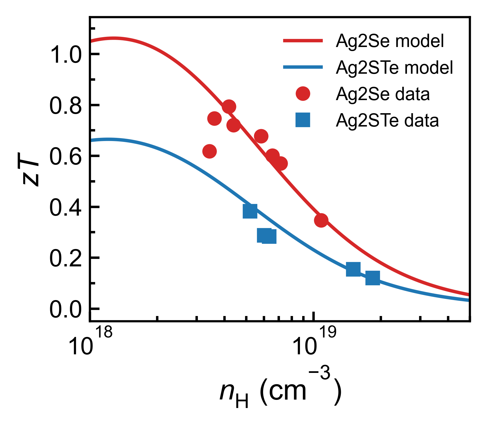
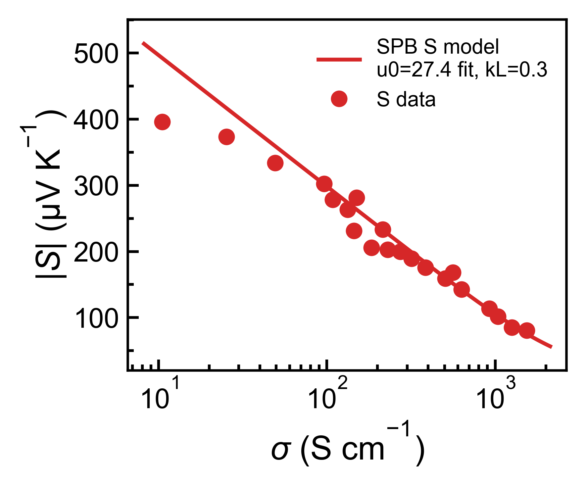
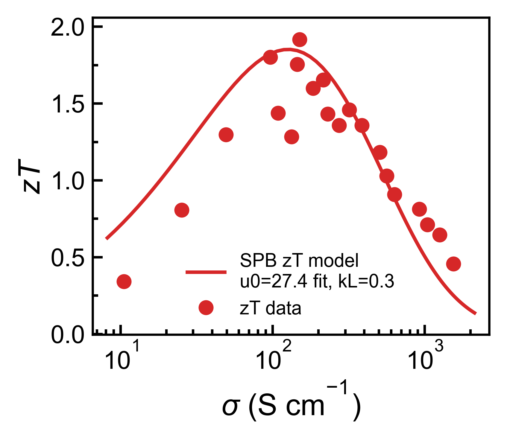

# Thermoelectric Analysis Workspace

This workspace keeps one root launcher, `main.py`, while source code, scripts,
data, configs, reports, and generated artifacts live in dedicated folders.

## Quick Start

Install dependencies:

```bash
pip install -r requirements.txt
```

Common launcher commands:

```bash
python main.py --help
python main.py analyze --help
python main.py plot-te --help
python main.py plot-xrd --help
python main.py flexible --help
python main.py spb --help
python main.py assess --help
python main.py bayes --help
```

Detailed plotting command notes:

- `docs/COMMANDS.md`
- `docs/FLEXIBLE_PLOTTING.md`

Agent-based analysis reads API keys from `.env` through `python-dotenv`.
Keep `.env` local and private.

## SPB Fitting Gallery

The v1.3.0 public package adds SPB fitting scripts, recipes, demo data, and
gallery figures.

| SPB Pisarenko view | SPB PF view | SPB conductivity view |
| --- | --- | --- |
|  |  |  |

| SPB zT view | SPB conductivity Seebeck | SPB conductivity zT |
| --- | --- | --- |
|  |  |  |

## Repository Layout

```text
.
├── main.py               # Root-level launcher for common tools
├── src/                  # Reusable Python source code
│   ├── agents/
│   └── tools/
├── scripts/              # Runnable analysis, plotting, sync, and utility scripts
│   ├── analysis/
│   └── plotting/
├── data/                 # Lab, reference, raw, and processed data
│   ├── raw/
│   ├── processed/
│   ├── lab/
│   ├── demo/
│   └── reference/
├── configs/              # JSON configs and plotting recipes
├── results/              # Main analysis outputs used by existing scripts
│   ├── reports/
│   ├── assessments/
│   ├── bayesian_predictions/
│   └── xrd_lattice/
├── outputs/              # Generated figures, artifacts, and exports
│   ├── figures/
│   ├── tables/
│   ├── logs/
│   └── cache/            # Ignored cache archive for generated local clutter
├── notebooks/            # Jupyter notebooks and local scratch work
├── docs/                 # Workflow notes and command references
├── skills/               # Local Codex skill instructions
├── external/             # External snapshots or vendored references
└── requirements.txt
```

## Naming Conventions

- Keep only `main.py` in the root as the user-facing launcher.
- Put runnable workflow scripts under `scripts/analysis/`, `scripts/plotting/`,
  or another focused `scripts/` subfolder.
- Put reusable implementation code under `src/`, not in notebooks.
- Keep raw experiment files under `data/raw/<batch_id>/`.
- Keep cleaned sample tables under `data/processed/<batch_id>-processed/`.
- Put plotting recipes and runtime options under `configs/`.
- Let current scripts write newly generated figures under `outputs/figures/`.
- Keep analysis tables, Markdown reports, and machine-readable result payloads
  under `results/`.
- Use `outputs/` for one-off exports, presentation artifacts, and manually
  generated figures that are not part of the standard analysis pipeline.
- Treat `outputs/cache/` as disposable local clutter collected from Python,
  Jupyter, and macOS metadata.
- Put external project snapshots under `external/` so they do not look like
  first-party source code.

## Recent Cleanup

- Moved command notes to `docs/COMMANDS.md`.
- Moved root composition-map PNGs to `outputs/figures/composition_maps/`.
- Moved PDF text extracts to `data/reference/pdf_extracts/`.
- Moved older report packages to `results/reports/research_reports/`.
- Moved external GitHub snapshots to `external/github/`.
- Renamed the temporary notebook to `notebooks/setup_env_template.ipynb` and
  replaced the hardcoded key with a placeholder.
