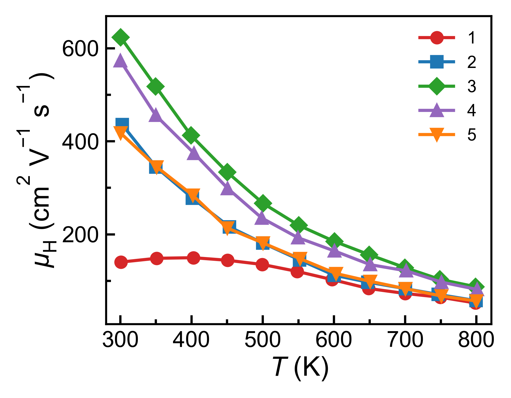
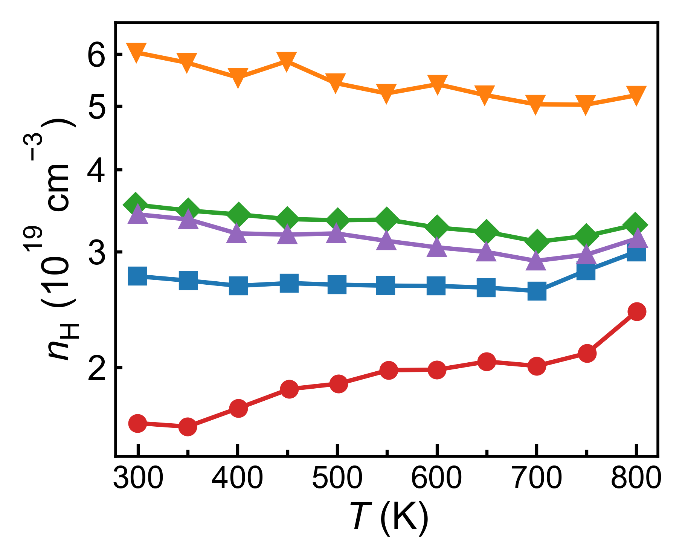
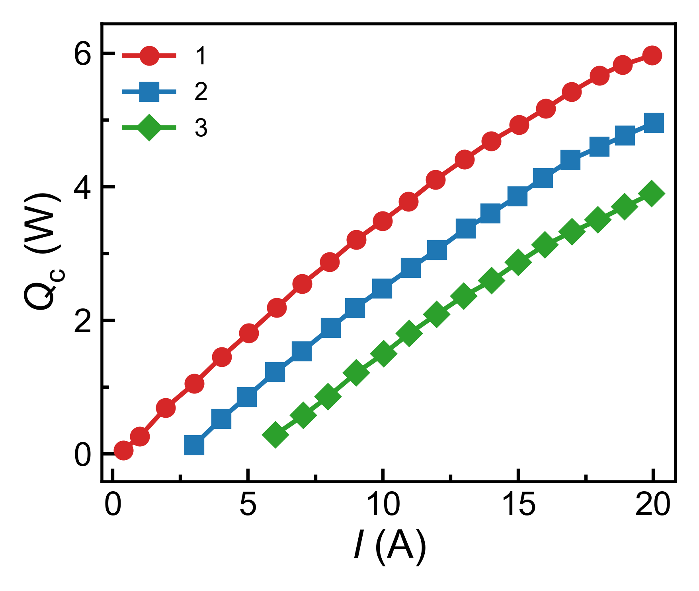
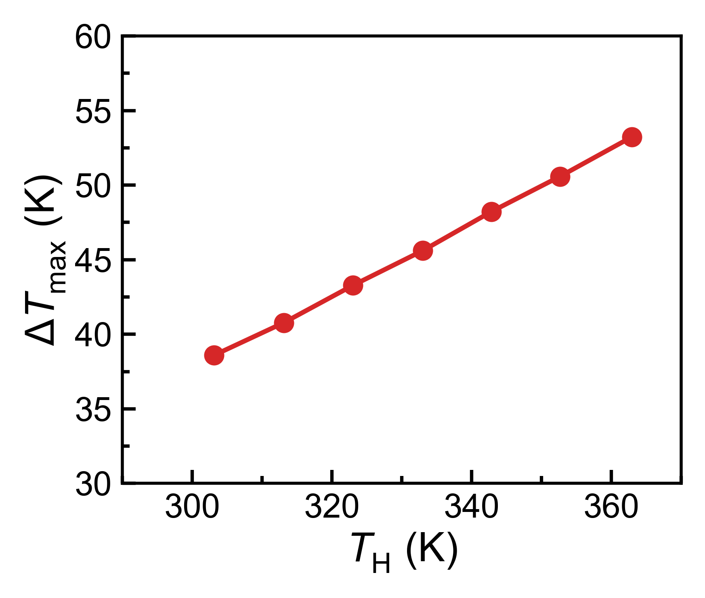
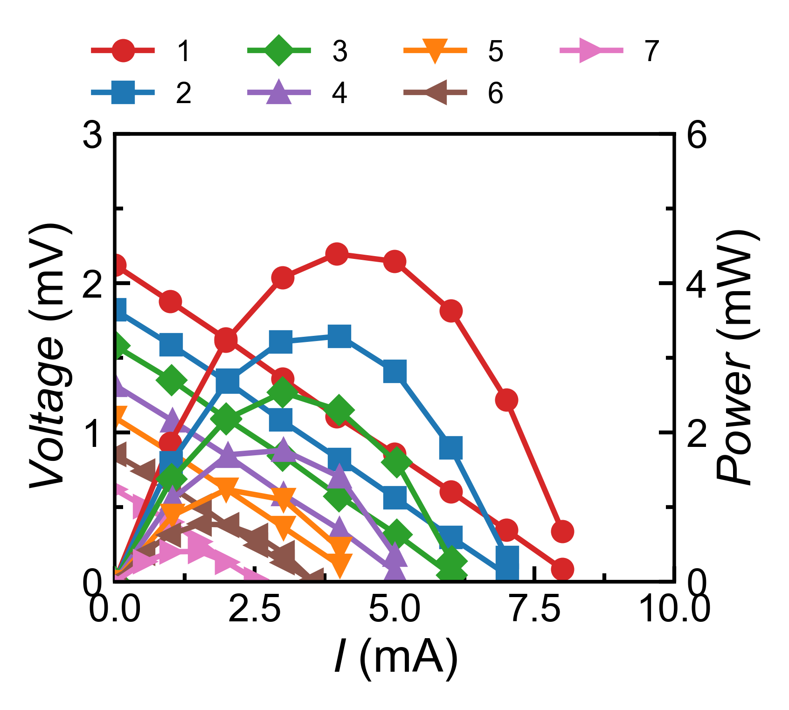
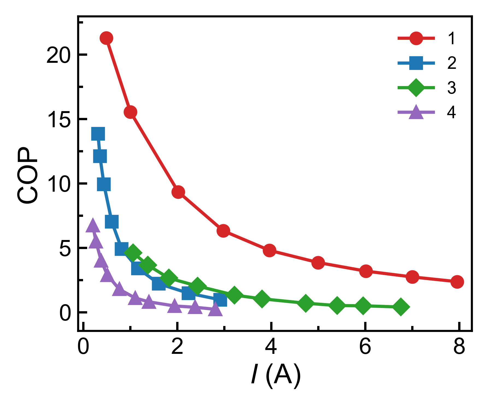
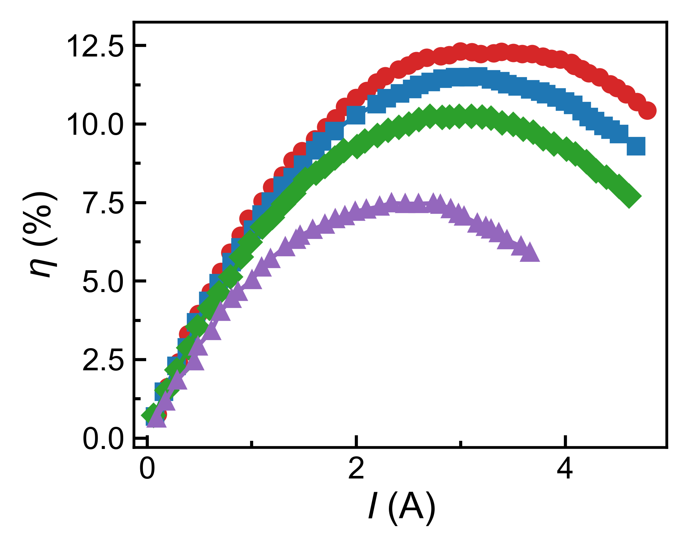
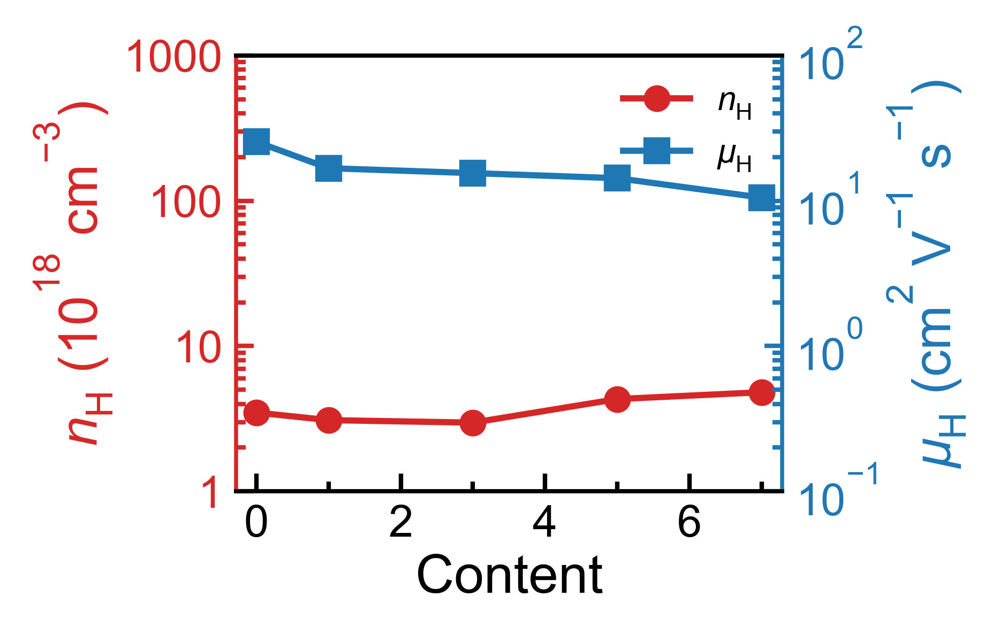

# Data Analysis and Plotting Workspace

Version: 1.2.0

This is a GitHub-ready package rebuilt from the current workspace source. It includes the analysis and plotting code, reusable plotting recipes, documentation, and public demo data only. Private lab data and generated outputs are intentionally not included.

Included:

- Root entry scripts: `run_analysis.py`, `plot_te.py`, `plot_XRD.py`, `flexible_plot.py`, `main.py`, `assess_selected_batches.py`, `bayesian_predict_te.py`.
- Source modules under `src/agents/` and `src/tools/`.
- Plot style helpers under `myplotstyle/`.
- Utility scripts under `scripts/`.
- Reusable configs under `configs/`.
- Public demo files under `data/demo/`.
- Empty placeholders for `data/raw/`, `data/processed/`, `data/lab/`, `data/reference/`, `data/pdf_card/`, `results/`, and `outputs/`.

Not included:

- Private raw data.
- Private processed data.
- Lab metadata ledgers.
- Reference PDF/data libraries.
- Generated results or output artifacts.
- Local Codex skills and external snapshots.
- `.env` or API keys.

## Quick Start

```bash
cd te-analysis-plotting-v1.2.0
python3 -m venv .venv
source .venv/bin/activate
python -m pip install --upgrade pip
pip install -e .
```

Or install with requirements:

```bash
pip install -r requirements.txt
```

## Demo Commands

Flexible plotting works immediately with the included demo data:

```bash
python flexible_plot.py --recipe configs/flexible_plot_demos/temperature_seebeck_line.json --formats png pdf --no-show
python flexible_plot.py --recipe configs/flexible_plot_demos/pbse_tec_qc_multi_files.json --formats png pdf --no-show
python flexible_plot.py --recipe configs/flexible_plot_demos/room_temp_dual_axis.json --formats png pdf --no-show
```

Direct one-off plotting:

```bash
python flexible_plot.py data/demo/max_cooling_capacity/1.csv \
  --kind line \
  --x I \
  --y Q \
  --xlabel '$I$ (A)' \
  --ylabel '$Q_{\mathrm{c}}$ (W)' \
  --stem quick_qc_demo \
  --formats png pdf \
  --no-show
```

Installed console entry:

```bash
te-flex-plot --recipe configs/flexible_plot_demos/temperature_seebeck_line.json --formats png pdf --no-show
```

Generated files are written under `outputs/`, which is ignored by git except for `.gitkeep`.

## Demo Gallery

These README images are copies of public demo figures in `data/demo/`.

-Demo data from references:

-Liu et al., “Ultralow Chromium Doping Enables All-PbSe Thermoelectric Cooling.”
-Jiang et al., “High-Entropy-Stabilized Chalcogenides with High Thermoelectric Performance.”
-Sun, C., Zhao, X., Qiu, P. et al. Flexible thermoelectric device with blade-like structure for ultrahigh output performance

| Temperature mobility | Temperature carrier concentration |
| --- | --- |
|  |  |

| Cooling capacity | Maximum cooling temperature |
| --- | --- |
|  |  |

| Voltage and power | COP |
| --- | --- |
|  |  |

| Device efficiency | Composition Hall dual axis |
| --- | --- |
|  |  |

## Using Your Own Data

Place private files locally after cloning:

```text
data/raw/
data/processed/
data/lab/
data/reference/
data/pdf_card/
```

Those folders are ignored by git in this release. Keep `data/demo/` committed so the examples remain reproducible.

Common entry points:

```bash
python run_analysis.py --help
python plot_te.py --help
python plot_XRD.py --help
python flexible_plot.py --help
python assess_selected_batches.py --help
python bayesian_predict_te.py --help
```

More details:

- `docs/PROJECT_STRUCTURE.md`
- `docs/COMMANDS.md`
- `docs/FLEXIBLE_PLOTTING.md`
