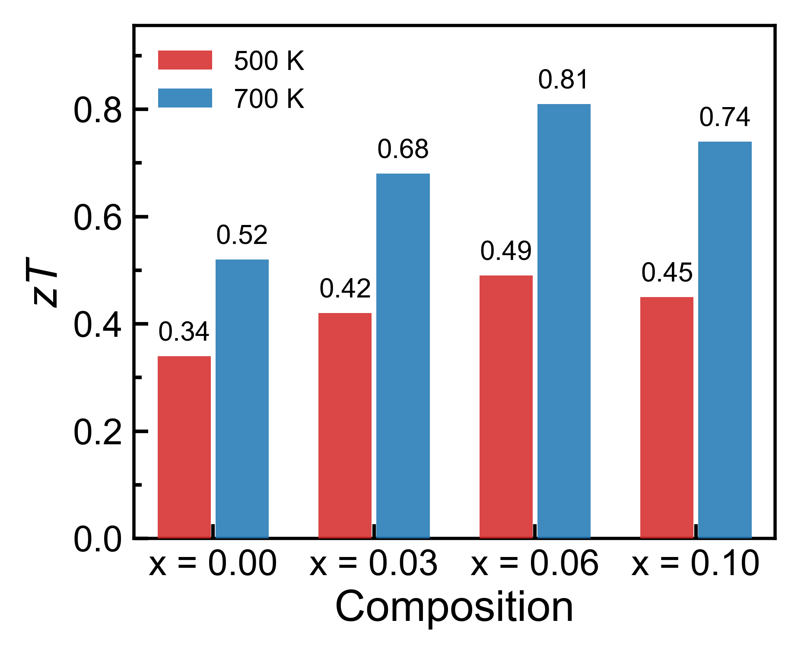
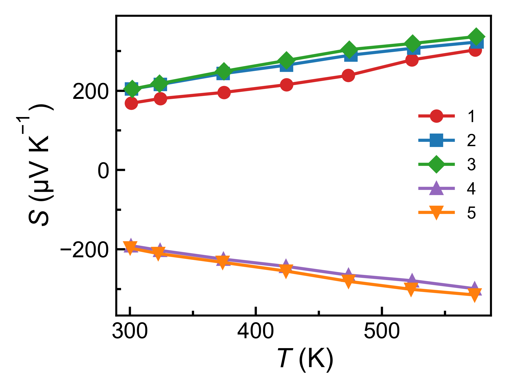
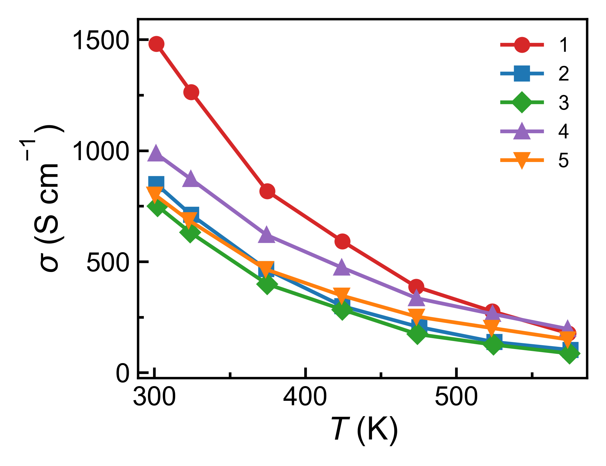
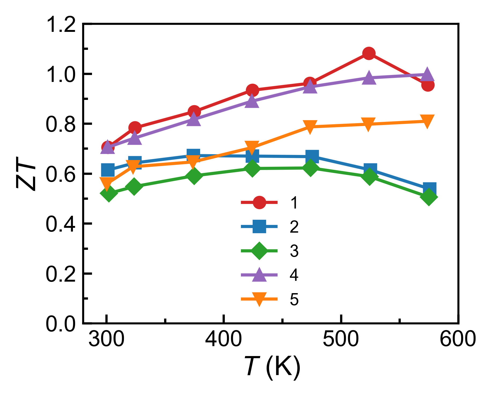

# TEDEX

TEDEX is a lightweight thermoelectric analysis and plotting toolkit. It keeps
the lab-style plotting defaults in one place, while letting you make quick
publication-style figures from processed TE transport tables, device curves,
XRD data, and loosely structured CSV/TXT/XLSX files.

Current public package: **v1.2.1**.

This public release includes source code, docs, reusable plotting recipes, and
demo files under `data/demo/`. Private raw data, processed lab data, lab
metadata, results, and generated outputs are not included.

## What's New in v1.2.1

- Added bar chart support to `flexible_plot.py` through `bar` and
  `grouped_bar` plot kinds.
- Added reusable bar recipes:
  `configs/plot_recipes/bar/simple_bar.json` and
  `configs/plot_recipes/bar/grouped_bar.json`.
- Added thermoelectric property recipes under
  `configs/plot_recipes/thermoeletric/` for Seebeck, conductivity, power
  factor, thermal conductivity, Lorenz number, weighted mobility, zT, and a
  multi-panel TE summary. The folder keeps the existing `thermoeletric`
  spelling for compatibility.
- Added demo outputs for bar charts and TE property plots in `data/demo/`.

## Demo Gallery

| Grouped bar | TE Seebeck | TE conductivity |
| --- | --- | --- |
|  |  |  |

| Sound velocity bars | TE zT | Device voltage/power |
| --- | --- | --- |
|  |  |  |

Demo references:

- `data/demo/COP/`, `data/demo/max_cooling_capacity/`, and
  `data/demo/device_efficiency/`: Liu et al., "Ultralow Chromium Doping
  Enables All-PbSe Thermoelectric Cooling."
- `data/demo/flexible_plotting/`, `data/demo/thermoelectric_property/`, and
  `data/demo/sound velocity/`: Jiang et al., "High-Entropy-Stabilized
  Chalcogenides with High Thermoelectric Performance."
- `data/demo/device power geenration/`: Sun, C., Zhao, X., Qiu, P. et al.,
  "Flexible thermoelectric device with blade-like structure for ultrahigh
  output performance."

## Install

Use Python 3.10 or newer.

```bash
git clone https://github.com/aioyouko/TEDEX.git
cd TEDEX

python -m venv .venv
source .venv/bin/activate
pip install -r requirements.txt
```

For editable command-line entry points:

```bash
pip install -e .
```

## Quick Examples

Run a grouped bar chart from the included demo table:

```bash
python flexible_plot.py data/demo/flexible_plotting/composition_grouped_bar_summary.csv \
  --recipe configs/plot_recipes/bar/grouped_bar.json \
  --x Composition \
  --y zT_500K \
  --y zT_700K \
  --label "500 K" \
  --label "700 K" \
  --ylabel "zT" \
  --stem quick_grouped_bar \
  --formats png pdf \
  --no-copy-to-data-dir \
  --no-show
```

Run a single thermoelectric property plot from demo TE data:

```bash
python flexible_plot.py \
  --recipe configs/plot_recipes/thermoeletric/temperature_vs_seebeck.json \
  data/demo/thermoelectric_property/1.csv \
  --stem quick_te_seebeck \
  --formats png pdf \
  --no-copy-to-data-dir \
  --no-show
```

Compare the same TE property across multiple demo samples:

```bash
python flexible_plot.py \
  --recipe configs/plot_recipes/thermoeletric/temperature_vs_zt.json \
  data/demo/thermoelectric_property/1.csv \
  data/demo/thermoelectric_property/2.csv \
  data/demo/thermoelectric_property/3.csv \
  --label "Sample 1" \
  --label "Sample 2" \
  --label "Sample 3" \
  --stem quick_te_zt_compare \
  --formats png pdf \
  --no-copy-to-data-dir \
  --no-show
```

Create a direct plot without a recipe:

```bash
python flexible_plot.py data/demo/max_cooling_capacity/1.csv \
  --kind line \
  --x I \
  --y Q \
  --xlabel '$I$ (A)' \
  --ylabel '$Q_{\mathrm{c}}$ (W)' \
  --stem quick_qc_demo \
  --formats png pdf \
  --no-show
```

Installed entry-point equivalent:

```bash
te-flex-plot data/demo/max_cooling_capacity/1.csv --kind line --x I --y Q --no-show
```

## Recipe Map

- `configs/plot_recipes/bar/`: simple and grouped categorical bar charts.
- `configs/plot_recipes/thermoeletric/`: processed TE property plots and
  summary panels.
- `configs/plot_recipes/device/`: device efficiency, COP, cooling capacity,
  maximum cooling temperature, and voltage/power plots.
- `configs/plot_recipes/temperature/`: temperature-dependent transport plots.
- `configs/plot_recipes/spb/`: carrier concentration trends for SPB-style
  comparisons.
- `configs/plot_recipes/dual_axis/`: two-axis composition or temperature plots.
- `configs/plot_recipes/lattice/`: composition versus lattice parameter.

Each saved figure also writes a normalized CSV by default, so the plotted x/y
columns, labels, groups, and source files are auditable.

## Entry Points

```bash
python plot_te.py --help
python plot_XRD.py --help
python flexible_plot.py --help
python assess_selected_batches.py --help
python bayesian_predict_te.py --help
```

After `pip install -e .`, the package also provides:

```bash
te-flex-plot --help
te-plot-xrd --help
te-assess-batches --help
te-bayes-predict --help
```

## Repository Layout

```text
.
├── src/                    # Reusable Python source
├── myplotstyle/             # Matplotlib style helpers
├── scripts/                 # Supporting CLI utilities
├── configs/plot_recipes/    # Reusable plotting recipes
├── data/demo/               # Public demo inputs and generated examples
├── docs/                    # Command notes and workflow docs
├── outputs/                 # Local generated figures, ignored by release
└── results/                 # Local generated analysis outputs, ignored by release
```

## Release Note

To publish this package to GitHub as a new release, see
`TEDEX_SYNC_RELEASE.md`. In short: sync this v1.2.1 folder into a fresh clone of
`aioyouko/TEDEX`, commit it, tag `v1.2.1`, push `main`, and push the tag.

## Acknowledgements

Documentation updates, release-check workflow notes, and selected code
maintenance for this public package were assisted by OpenAI Codex, with final
review and responsibility by Heyang Chen.

## Copyright And Contact

Copyright (c) 2026 Heyang Chen. All rights reserved unless a separate license
file is added to this repository.

For questions, collaborations, or citation details, contact:

- Heyang Chen
- heyang.chen@ntu.edu.sg
- heyang.chen@northwestern.edu
- School of Materials Science and Engineering, Nanyang Technological
  University, Singapore
- Department of Chemistry, Northwestern University, Evanston, IL, USA
