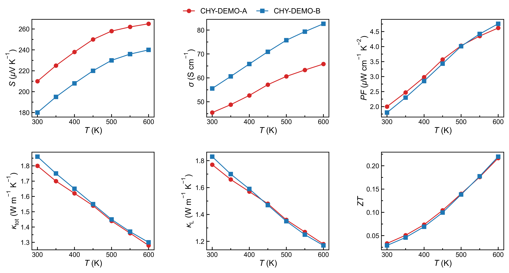
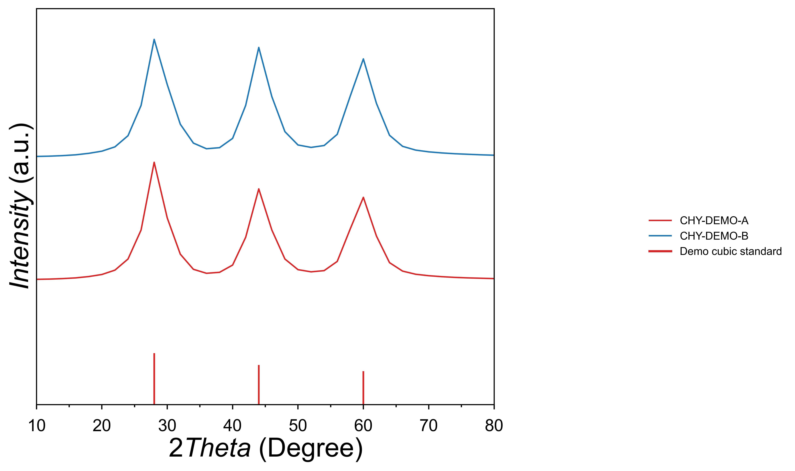

# TE Analysis and Plotting Workflow

Version: 1.1.0

This folder is a standalone release of the thermoelectric analysis and plotting workflow. It keeps the original project-style entry points:

- `run_analysis.py`: raw ZEM/LFA files to processed transport CSV, feature JSON, and summary plots.
- `plot_te.py`: batch, sample, inter-batch, and direct processed-CSV plotting.
- `plot_XRD.py`: stacked raw or normalized XRD pattern plotting with optional PDF-card overlay.
- `scripts/plot_room_temp_dual_axis.py`: room-temperature Seebeck/conductivity comparison.
- `scripts/plot_paper_style_te_variants.py`: compact paper-style plot variants.
- `scripts/sync_lab_metadata.py` and `scripts/sync_lab_markdown.py`: lab metadata discovery and editing.

The release template intentionally does not include private raw data, processed data, or generated results. Those folders are present as empty placeholders. Version 1.1.0 adds XRD plotting only; lattice-parameter fitting is intentionally not included.

## Quick Start

```bash
cd te-analysis-plotting-v1.1.0
python3 -m venv .venv
source .venv/bin/activate
python -m pip install --upgrade pip
pip install -e .
```

You can also install only the requirements:

```bash
pip install -r requirements.txt
```

## Try The Demo

The demo uses small synthetic processed TE CSV files and synthetic XRD `.xy` files, so it tests plotting without private lab data.

```bash
cd examples/demo_project
python ../../plot_te.py CHY-DEMO --plot-mode both --formats png pdf --no-show
python ../../scripts/plot_room_temp_dual_axis.py --workspace . --samples CHY-DEMO --formats png pdf
python ../../plot_XRD.py CHY-DEMO --mode both --formats png pdf
python ../../plot_XRD.py CHY-DEMO --mode normalized --pdf-card demo_cubic_standard --formats png pdf
```

Outputs are written under `examples/demo_project/results/plots/`.

### Demo Figures

The static images below were generated from the synthetic demo project and are stored in `docs/demo_images/` so they can be displayed directly in this README.

**TE transport summary**



**XRD pattern with PDF-card overlay**



If you installed with `pip install -e .`, the equivalent console commands are:

```bash
te-plot CHY-DEMO --plot-mode both --formats png pdf --no-show
te-room-temp-dual --workspace . --samples CHY-DEMO --formats png pdf
te-plot-xrd CHY-DEMO --mode both --formats png pdf
```

## Configure Your Own Data

Use this folder as the root of one TE workflow repository.

```text
data/
  raw/
    CHY-1051/
      CHY-1051-A_ZEM.txt
      CHY-1051-A_LFA.csv
      XRD/
        CHY-1051-A_XRD.xy
  lab/
    batches.json
    samples.json
    lab_metadata.md
  pdf_card/
    plot_standards/
  processed/
results/
```

Raw file names should follow:

```text
<sample_id>_ZEM.txt
<sample_id>_LFA.csv
<sample_id>_LFA.txt
<batch_id>/XRD/<sample_id>_XRD.xy
```

Then run:

```bash
python scripts/sync_lab_metadata.py
```

Edit `data/lab/lab_metadata.md` to fill density, heat capacity, sample composition, and notes. Import the edits:

```bash
python scripts/sync_lab_markdown.py
```

Run analysis:

```bash
python run_analysis.py CHY-1051
```

Create publication-style plots from processed CSV:

```bash
python plot_te.py CHY-1051 --plot-mode both --formats png pdf --no-show
python plot_te.py CHY-1051-A --seebeck --conductivity --formats png pdf --no-show
python plot_te.py CHY-1036 CHY-1040 CHY-1051 --inter-batch --plot-mode single --properties seebeck conductivity zt --formats png pdf --no-show
```

Create XRD plots:

```bash
python plot_XRD.py CHY-1051 --mode both --formats png pdf
python plot_XRD.py CHY-1051-A --mode normalized --formats png pdf
python plot_XRD.py CHY-1051 --pdf-card CuInTe2_PDF_97_023_8958 --formats png pdf
```

## Data Assumptions

The raw-data parser currently assumes:

- ZEM files are tab-delimited text with two header rows skipped.
- ZEM columns 0, 1, 4, and 5 map to temperature in Celsius, resistivity in ohm m, Seebeck in V/K, and power factor in W m^-1 K^-2.
- LFA files are either compact two-column CSV files or instrument exports containing `#Mean` rows.
- LFA temperature is in Celsius and diffusivity is used with density and heat capacity to compute thermal conductivity.
- Processed transport CSV files use temperature in K, conductivity in S/m, Seebeck in V/K, thermal conductivity in W m^-1 K^-1, and ZT as dimensionless.
- XRD `.xy` files are two numeric columns: 2-theta in degrees and intensity counts. Header lines are ignored.
- XRD PDF-card standards should be CSV files under `data/pdf_card/plot_standards` with at least `two_theta_deg` and `intensity` columns.

See `docs/DATA_LAYOUT.md` and `docs/COMMANDS.md` for more detail.

## GitHub Notes

The `.gitignore` keeps `data/raw`, `data/processed`, and `results` out of version control by default. Commit code, docs, metadata templates, and lightweight examples; keep experimental data in a private location unless you explicitly want to publish it.
